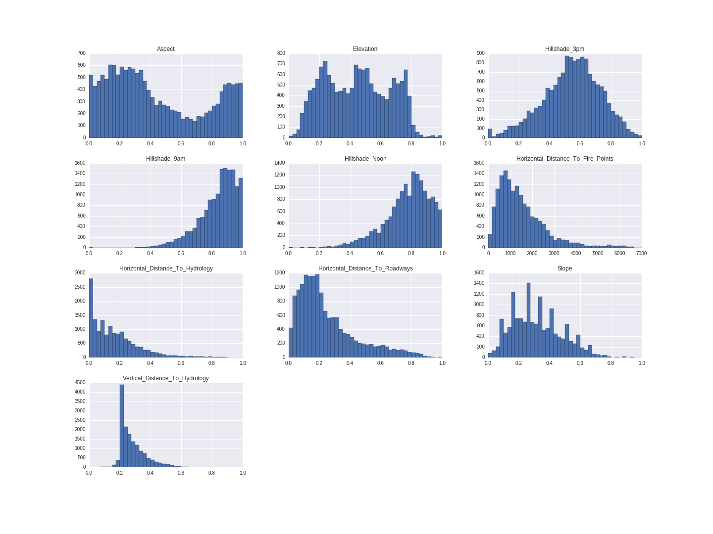
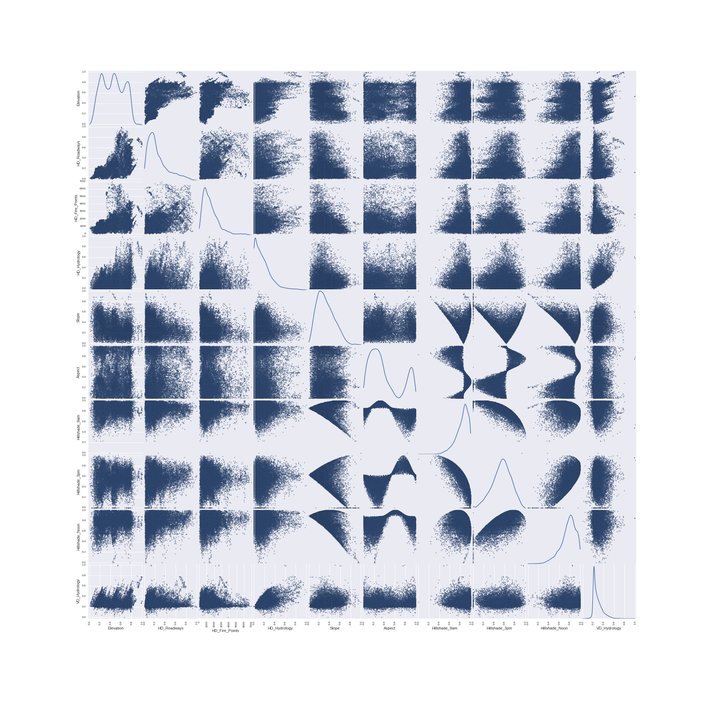
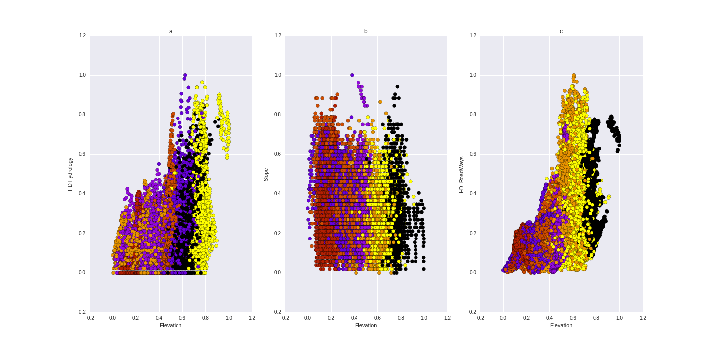
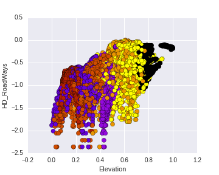
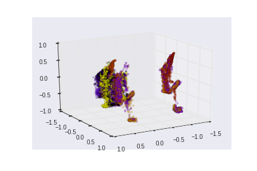
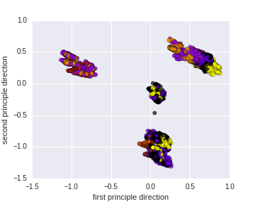

# Introduction

Land management agencies record inventories of natural resources, and a key part of this includes mapping the predominant species of tree throughout their forests. Generally there are two ways of getting this forest cover type : remote sensing, and sending personnel into the field to manually record it. However, these options may be prohibitively time consuming, costly, or legally impossible [@blackard] . But what if we have cartographic information available to us, such as elevation, slope, distance to water features, incident sunlight can we use this data to predict cover type? This is the question we explore in this project using Linear Discriminant Analysis, Quadratic Discriminant Analysis, Logistic regression and dimensionality reduction.

# Methodology

## Dataset
This problem is a classification problem where the information about the forests is given as 54 features and the goal is to predict an integer classification for the forest cover type. The seven types are Spruce/Fir, Lodgepole Pine, Ponderosa Pine, Cottonwood/Willow, Aspen, Douglas-fir and Krummholz. Among the 54 features, 10 quantitative variables are Elevation, Aspect, Slope, Horizontal Distance To Hydrology, Vertical Distance To Hydrology, Horizontal Distance To Roadways, Hillshade at 9am, Hillshade at Noon, Hillshade at 3pm and Horizontal Distance To Fire Points. Wilderness area designation and soil type designation contain 4 and 40 binary columns respectively, where 0 stands for absence and 1 for presence of that variable. The dataset comprise training set of 565892 observation. All the data provided is cartographic i.e. no location data is provided.

## Exploratory Data Analysis

In the first step to explore the examine the dataset we look at the distribution of the first 10 continuos variables. 



Examing figure \ref{histogram} shows that some of the variables skewed and we can use log or other feature transofrmation techniques to reduce the skewness and possiblly improve the accuracy. Also, we can see that there's some missing values in Hillshade_3pm variable. It's possbile to replace the missing values using imputation process if it is neccessary.

Next we plot the scatter plot matrices of the 10 continous variable and look how different variables relate to each other (figure \ref{splom}).




It is also interesting to look at relationship between elevation and other variables while color coding for each class.



We can explore if transforming horizental distance to roadways can imporve the distribution of the classes.




## Linear Discreminant Analysis

This model assumes that the conditional distribution
of the features given the class is
gaussian and is the same across all classes [@ESL] . This assumption is not explicitly
true for our dataset and all classes
having the same covariance matrix does
not seem to be a good assumption. The first step in LDA is calculating the sample statisitics $\pi, \mu, \cal{\sigma}$.
Then the data points are sphered based on factoring $\cal{\sigma}$, then  projected down to the affine subspace spanned 
by the sphered centroids. Then any data point $x$ is transformed and classify according to the class for which:

\begin{center}
$\frac{1}{2}|| \tilde{x} - \tilde{\mu_j}||_2^2 - log \hat{\pi_j}$ 
\end{center}

is the smallest.


Quadratic Discriminant Analysis
(QDA) is more general version of LDA, which separates
the classes by a quadric surface and assumes each class has an individual covariance matrix.


## Logistic Regression

Logistic regression is a probabilistic, linear classifier. It is parametrized by a weight matrix $W$ and a bias vector $b$. Classification is done by projecting an input vector onto a set of hyperplanes, each of which corresponds to a class. The distance from the input to a hyperplane reflects the probability that the input is a member of the corresponding class.
Learning optimal model parameters involves minimizing a loss function. In the case of multi-class logistic regression,  the negative log-likelihood is  appropriate as the loss. This is equivalent to maximizing the likelihood of the data set $\cal{D}$ under the model parameterized by $\theta$. The log loss is defined as:


\begin{center}

$\cal{L} ( \theta = W,b, \cal{D}) = \sum_{i=0}^{|\cal{D}|} log(P(Y = y^i | x^i, W,b))$

$l(\theta = (W,b), \cal{D}) = \cal{L}( \theta = (W,b), D)$

\end{center}


Gradient descent is by far the simplest method for minimizing arbitrary non-linear functions. The method of stochastic gradient method with mini-batches (SGD) was implemented to minimize the loss function for logistic regression. The SGD was implement with the help of theano package which can effcieintly calculate complicated derivativs using symbolic differentiation. When using SGD, accuracy of the model is highly dependent on number size of mini-batches, the learning costant  and number epochs the we iterate over the dataset. The dataset was devided into training, testing and validation segment.  The training set is used find the weights of the models while the validation test was used to implement an early stoping logic. The test set was used to test the final trained model.

## Principal Component Analysis

Principal components analysis (PCA) is a classical method that provides a sequence
of best linear approximations to a given high-dimensional observation. It is one of the
most popular techniques for dimensionality reduction. However, its effectiveness is limited
by its global linearity. The subspace
modeled by PCA captures the maximum variability in the data, and can be viewed as
modeling the covariance structure of the data. The linear subspace can be specified by d orthogonal vectors that form a new coordinate
system, called the ‘principal components’. The principal components are orthogonal, linear
transformations of the original data points, so there can be no more than original dimensions of dataset.

# Cross Validation
A cross validation function was develope which devids the data set in to K equal section and train the model on K-1 section and subsequently test the model of the remaining section. The cross validation is not used since the logistic regression parameters was selected based on a grid search and the QDA and LDA algorithm were very slow and training the data multiple times was not possible. Hence the the dataset was devided in to training and testing.

# Results and Discussion

In the first step, the three models were implemented on the dataset without any transformation and demensionaltiy reduction. The resulting accuracy is listed in table 1 for training and testing section.

|Model| % Train error  | % Test error |
|:-----:|:-------:|:------:|
|Logistic Regression|37.03| 44.37|
|LDA| 86.3 | 84.7 |
|QDA|  83.8 | 84.7 |

The QDA classifirer became unstable (factored covariance matrix is singular) when discrete variables are present. THe QDA result in Table 1 was obtained by fitting the model using the 10 continous variables in the dataset.







The next step is applying Principle component analysis and try to reduce the dimensionalty of the problem.
The first two principle component direction can explain 39.5% of variation in the data and adding the third and fourth variable can explain the 46% of variation. The first two and three principle dimension was used to draw a 2d and 3d plot color coded with class label. figures \ref{3d}, \ref{2d}. Table 2 shows the accuracy of the three models trained on the first 10 principle component directions.

|Model| % Train error  | % Test error |
|:-----:|:-------:|:------:|
|Logistic Regression|41.2|  46.9|
|LDA| 47.6 | 54.3 |
|QDA|  42.9 | 44.3 |


The dimension reduction was sucessful in the case logistic regression and LDA but did not change the error rate of 
in the case of QDA. 

In the next step the three variable Horizental_distance_to_roadways, Horizontal_distance_to_Hydrology and Hillshade_9am are transformed to using log10 
and Pricinple component Analysis was perfomed. The transformiones did not improved the results in any of the three models. We can compare the accuracy obtained the our three classifier with the result publish by blackard [@blackard]. The Artificial Neural Netwrok use in their study achieved 70.51% accuracy. This shows that there is room to improve the prediction either by using another machine learning technique of using ensamble of the predicted values by diffrent models.


# Appendix

## LDA Class (Contains both LDA and QDA)
```{python eval=F}
"""
QDA and LDA for Stat 557

"""

import numpy as np
from scipy.linalg import eig, inv
from numpy import diag, real, transpose, log, dot, sqrt


class DA(object):
    """
    Linear Discriminant Analysis
    """

    def __init__(self, x, y, mode="LDA"):
        """
        inputs:
            x: matrix of predictor
            y: matrix of response
        """
        self.x = x
        self.y = y
        self.mode = mode
        self.xDim = np.shape(x)
        self.yDim = np.shape(y)
        self.classSize = len(set(y))
        self.classMember = set(y)
        self.classMean = {}
        self.priorProbability = {}
        self.classCovMatrix = {}
        self.commonCovMatrix = None
        self.eigen_dict = {}

    def sampleEstimate(self):
        """
        compute the mean and covariance matrix and class prior probability
        """
        for K in self.classMember:
            classK_data = self.x[self.y == K, ]
            self.classMean[K] = np.transpose(np.mean(classK_data, 0))
            self.priorProbability[K] = sum(self.y == K) / len(self.y)
            self.classCovMatrix[K] = np.cov(np.transpose(classK_data))
        self.commonCovMatrix = np.cov(np.transpose(self.x))

    def fit(self):
        self.sampleEstimate()
        self.eigen_dict = self.eigDecomp()

    def LDA(self, x):
        """
        inputs:
            x: numpy array
        output:
            delta_k: dictionary detla for each class
        """
        #self.sampleEstimate()
        delta_k = {}
        D, U = eig(self.commonCovMatrix)

        for K in self.classMember:
            x_sphered = dot(dot(diag(1/sqrt(real(D))), U.T), x)
            trans_centroid = dot(dot(diag(1/sqrt(real(D))), U.T),
                                 self.classMean[K])
            delta_k[K] = 0.5 * sqrt(sum((x_sphered - trans_centroid) ** 2)) - \
                log(self.priorProbability[K])

        return min(delta_k, key=delta_k.get)

    def eigDecomp(self):
        """
        eigen value decomposition for each class
        returns dictionary of eig vectors and eigen values for each class
`        """
        eigen_dict = {}
        for key in self.classCovMatrix:
            eigen_dict[key] = eig(self.classCovMatrix[key])
        return eigen_dict

    def QDA(self, x):
        """
        inputs:
            x: numpy array
        output:
            maximum delta between classes
        """
        delta_k = {}
        # self.sampleEstimate()
        eigen_dict = self.eigen_dict
        for K in self.classMember:
            D_k = diag(real(eigen_dict[K][0]))
            U_k = eigen_dict[K][1]
            log_cov = sum(diag(D_k))
            part2 = dot(dot(transpose(dot(U_k.T,
                                      (x - self.classMean[K]))), inv(D_k)),
                        (dot(U_k.T, (x - self.classMean[K]))))
            part3 = log(self.priorProbability[K])

            delta_k[K] = -0.5 * log_cov - 0.5 * part2 + part3
        return max(delta_k, key=delta_k.get)

    def summary(self):
        self.accuracy = sum(self.y_hat == self.y) / len(self.y)
        print("accuracy: ", self.accuracy)

    def predict(self, X, Y):
        """
        return predicted class and error rate
        parameter:
            X: input numpy array
            Y: class label numpy array
        returns:
            predicted label and error rate
        """
        y_hat = []
        if self.mode == "LDA":
            for x in X:
                y_hat.append(self.LDA(x))
        if self.mode == "QDA":
            for x in X:
                y_hat.append(self.QDA(x))

        error = 1 - sum(Y == y_hat) / len(Y)
        return y_hat, error
```

## Logistic Regression Class

```{python eval=F}
from __future__ import print_function
import numpy as np
import six.moves.cPickle as pickle
import os
import sys
import timeit
import theano
import theano.tensor as T


class LogisticRegression(object):


    def __init__(self, input, n_in, n_out):

        self.W = theano.shared(
            value=np.zeros(
                (n_in, n_out),
                dtype=theano.config.floatX
            ),
            name='W',
            borrow=True
        )
        self.b = theano.shared(
            value=np.zeros(
                (n_out,),
                dtype=theano.config.floatX
            ),
            name='b',
            borrow=True
        )


        self.p_y_given_x = T.nnet.softmax(T.dot(input, self.W) + self.b)


        self.y_pred = T.argmax(self.p_y_given_x, axis=1)

        self.params = [self.W, self.b]

        self.input = input

    def negative_log_likelihood(self, y):

        return -T.mean(T.log(self.p_y_given_x)[T.arange(y.shape[0]), y])


    def errors(self, y):

        if y.ndim != self.y_pred.ndim:
            raise TypeError(
                'y should have the same shape as self.y_pred',
                ('y', y.type, 'y_pred', self.y_pred.type)
            )
        if y.dtype.startswith('int'):
            return T.mean(T.neq(self.y_pred, y))
        else:
            raise NotImplementedError()


def load_data(X, Y):

    def shared_dataset(data_x, data_y, borrow=True):

        data_x = data_x
        data_y = data_y
        shared_x = theano.shared(np.asarray(data_x,
                                               dtype=theano.config.floatX),
                                 borrow=borrow)
        shared_y = theano.shared(np.asarray(data_y,
                                               dtype=theano.config.floatX),
                                 borrow=borrow)
        return shared_x, T.cast(shared_y, 'int32')

    train_len = int(.6 * len(X))
    test_len = int(len(X) - train_len) / 2
    valid_len = int(len(X) - train_len) / 2

    test_set_x, test_set_y = shared_dataset(X[:train_len], Y[:train_len])
    valid_set_x, valid_set_y = shared_dataset(X[train_len: train_len + test_len],
                                              Y[train_len: train_len + test_len])
    train_set_x, train_set_y = shared_dataset(X[train_len + test_len: train_len + 2*test_len],
                                              Y[train_len + test_len: train_len + 2*test_len])

    rval = [(train_set_x, train_set_y), (valid_set_x, valid_set_y),
            (test_set_x, test_set_y)]

    return rval


def sgd(X, Y, n_in, n_out, learning_rate=0.13, n_epochs=1000, batch_size=600):
    datasets = load_data(X,Y)

    train_set_x, train_set_y = datasets[0]
    valid_set_x, valid_set_y = datasets[1]
    test_set_x, test_set_y = datasets[2]

    n_train_batches = train_set_x.get_value(borrow=True).shape[0] // batch_size
    n_valid_batches = valid_set_x.get_value(borrow=True).shape[0] // batch_size
    n_test_batches = test_set_x.get_value(borrow=True).shape[0] // batch_size

    print('... building the model')

    index = T.lscalar()
    x = T.matrix('x')
    y = T.ivector('y')
    classifier = LogisticRegression(x, n_in, n_out)

    cost = classifier.negative_log_likelihood(y)


    test_model = theano.function(
        inputs=[index],
        outputs=classifier.errors(y),
        givens={
            x: test_set_x[index * batch_size: (index + 1) * batch_size],
            y: test_set_y[index * batch_size: (index + 1) * batch_size]
        }
    )

    validate_model = theano.function(
        inputs=[index],
        outputs=classifier.errors(y),
        givens={
            x: valid_set_x[index * batch_size: (index + 1) * batch_size],
            y: valid_set_y[index * batch_size: (index + 1) * batch_size]
        }
    )


    g_W = T.grad(cost=cost, wrt=classifier.W)
    g_b = T.grad(cost=cost, wrt=classifier.b)


    updates = [(classifier.W, classifier.W - learning_rate * g_W),
               (classifier.b, classifier.b - learning_rate * g_b)]


    train_model = theano.function(
        inputs=[index],
        outputs=cost,
        updates=updates,
        givens={
            x: train_set_x[index * batch_size: (index + 1) * batch_size],
            y: train_set_y[index * batch_size: (index + 1) * batch_size]
        }
    )

    print('... training the model')
    patience = 5000  # look as this many examples regardless
    patience_increase = 2  # wait this much longer when a new best is
                                  # found
    improvement_threshold = 0.995  # a relative improvement of this much is
                                  # considered significant
    validation_frequency = min(n_train_batches, patience // 2)
                                  # go through this many
                                  # minibatche before checking the network
                                  # on the validation set; in this case we
                                  # check every epoch

    best_validation_loss = np.inf
    test_score = 0.
    start_time = timeit.default_timer()

    done_looping = False
    epoch = 0
    while (epoch < n_epochs) and (not done_looping):
        epoch = epoch + 1
        for minibatch_index in range(n_train_batches):

            minibatch_avg_cost = train_model(minibatch_index)
            # iteration number
            iter = (epoch - 1) * n_train_batches + minibatch_index

            if (iter + 1) % validation_frequency == 0:
                # compute zero-one loss on validation set
                validation_losses = [validate_model(i)
                                     for i in range(n_valid_batches)]
                this_validation_loss = np.mean(validation_losses)

                print(
                    'epoch %i, minibatch %i/%i, validation error %f %%' %
                    (
                        epoch,
                        minibatch_index + 1,
                        n_train_batches,
                        this_validation_loss * 100.
                    )
                )

                # if we got the best validation score until now
                if this_validation_loss < best_validation_loss:
                    #improve patience if loss improvement is good enough
                    if this_validation_loss < best_validation_loss *  \
                       improvement_threshold:
                        patience = max(patience, iter * patience_increase)

                    best_validation_loss = this_validation_loss
                    # test it on the test set

                    test_losses = [test_model(i)
                                   for i in range(n_test_batches)]
                    test_score = np.mean(test_losses)

                    print(
                        (
                            '     epoch %i, minibatch %i/%i, test error of'
                            ' best model %f %%'
                        ) %
                        (
                            epoch,
                            minibatch_index + 1,
                            n_train_batches,
                            test_score * 100.
                        )
                    )

                    # save the best model
                    with open('best_model.pkl', 'wb') as f:
                        pickle.dump(classifier, f)

            if patience <= iter:
                done_looping = True
                break

    end_time = timeit.default_timer()
    print(
        (
            'Optimization complete with best validation score of %f %%,'
            'with test performance %f %%'
        )
        % (best_validation_loss * 100., test_score * 100.)
    )
    print('The code run for %d epochs, with %f epochs/sec' % (
        epoch, 1. * epoch / (end_time - start_time)))
    print(('The code for file ' +
           ' ran for %.1fs' % ((end_time - start_time))), file=sys.stderr)


def predict(X, Y):
    """
    An example of how to load a trained model and use it
    to predict labels.
    """

    # load the saved model
    classifier = pickle.load(open('best_model.pkl'))

    # compile a predictor function
    predict_model = theano.function(
        inputs=[classifier.input],
        outputs=classifier.y_pred)

    datasets = load_data(X, Y)
    test_set_x, test_set_y = datasets[2]
    test_set_x = test_set_x.get_value()

    predicted_values = predict_model(test_set_x)
    return predicted_values

```


## Principle Component Analysis class
```{python eval=F}
"""
Principle Component Analysis
"""

from numpy import shape, mean, var, dot, abs, real, reshape, array
from scipy.linalg import eig
from collections import OrderedDict


class PCA(object):

    """
    Principle Componenet Analysis
    """

    def __init__(self, x):
        """
        inputs:
            numpy array with nxp dimension
        """

        self.x = x
        self.dim = shape(x)
        self.centerd_x = x - mean(x, 0)
        self.means = mean(x, 0)
        self.vars = var(x, 0)

    def fit(self):
        """
        returns:
            sorted eigen values/vectors tuple
         """
        eigval, eigvec = eig(dot(self.centerd_x.T, self.centerd_x))
        # eig_pairs = [(abs(eigval[i]), eigvec[:, i]) for i in range(len(eigval))]

        eig_pairs = {abs(eigval[i]): eigvec[:, i] for i in range(len(eigval))}
        #print(shape(eig_pairs))
        # eig_pairs.sort(reverse=True)

        return OrderedDict(sorted(eig_pairs.items(), reverse=True))

    def summary(self, n=None):

        pairs = self.fit()
        d = [i for i,j in pairs.items()]
        #self.d = reshape(d, (1, self.dim[1]))

        if n is None:
            n = self.dim[1]

        var_exp = (d / sum(d))
        return var_exp[:n]

    def transform(self, n=None):
        pairs = self.fit()
        W = [j for i,j in pairs.items()]
        if n is None:
            n = self.dim[1]
       #W = reshape(W, (self.dim[1], self.dim[1]), order='C')
        W = array(W)
        self.W = W
        X_new = dot(self.centerd_x, W.T[:, :n])
        return X_new

    def decomp(self):
        return self.d, self.W
```


## Cross Validation function

```{python eval=F}
"""
module for cross validation
"""

from numpy.random import shuffle


def cv(model, mode, k_fold, X, Y):
    """
    cross validation

    parameters:
    model: model object used for fitting
    k_fold: number fold to devide the data
    X: input data numpy arraya
    Y: class label numpy array
    """
    if len(X) % k_fold:
        fold_size = int(len(X) / k_fold)
    else:
        fold_size = int(len(X) // k_fold)
    indx = list(range(len(X)))
    shuffle(indx)
    test_indx = [indx[i: i + fold_size] for i in range(0, len(indx), fold_size)]

    test_error = []
    train_error = []

    for fold in test_indx:
        train_indx = list(set(indx) - set(fold))
        X_train = X[train_indx]
        Y_train = Y[train_indx]
        X_test = X[fold]
        Y_test = Y[fold]

        fit = model(X_train, Y_train, mode)
        train_error.append(fit.predict(X_train, Y_train)[1])
        test_error.append(fit.predict(X_test, Y_test)[1])
    return train_error, test_error
```


# References
